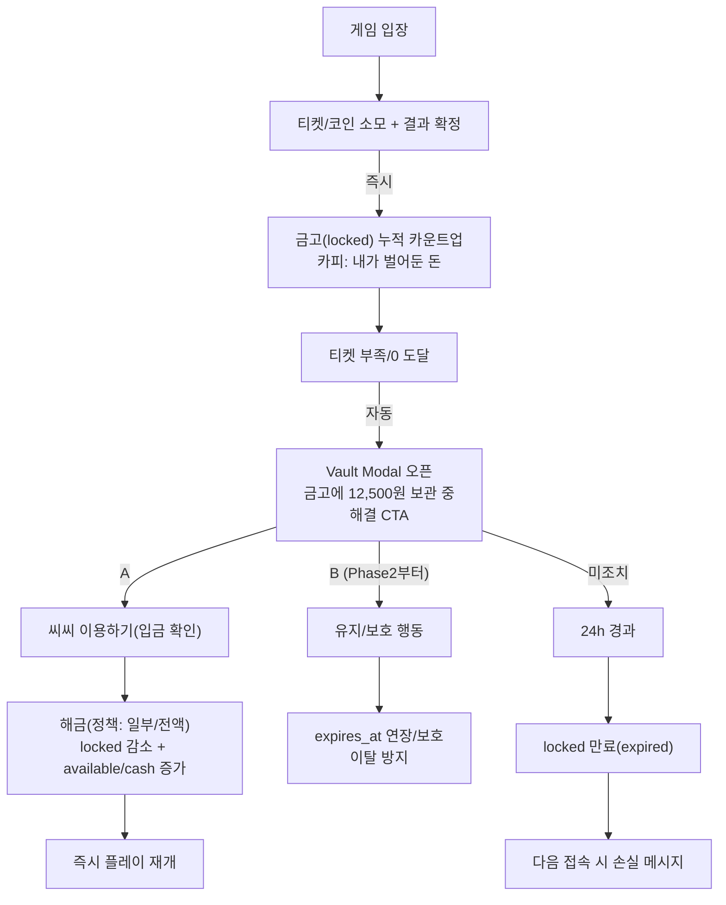
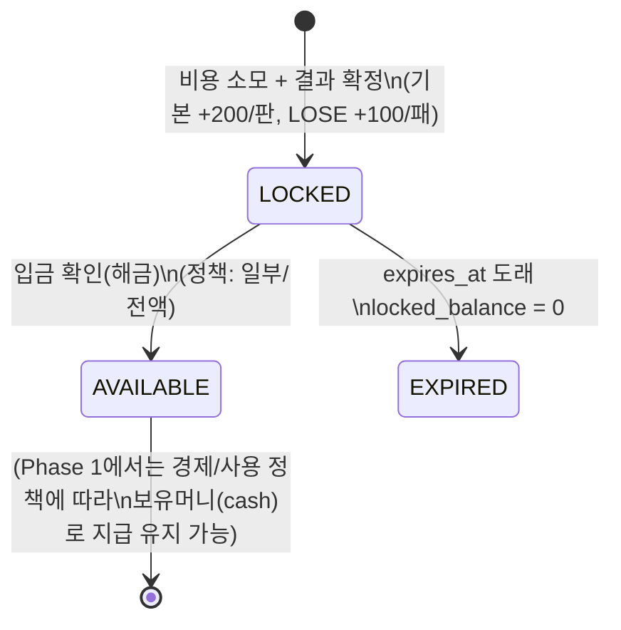

# Vault(금고) 최종 설계 — Phase 1 Reset + 기존유저 전략 + 체험티켓 보상 적립(50판 황금선)

- 문서 타입: 통합(정책 + UX 흐름 + 상태머신 + BE/FE/DB 맵핑)
- 버전: v2.2
- 작성일: 2025-12-23
- 대상 독자: 기획자, 백엔드/프론트엔드 개발자
- 스코프: Phase 1(Reset) + Phase 2 확장 가드레일(Protect)까지

통합 대상(레거시 문서)
- `docs/05_modules/05_module_vault_master_reset_phase1.md`
- `docs/05_modules/05_module_vault_existing_user_strategy_v2.0.md`

운영 원칙
- 앞으로 Phase 1/2 정책/상태머신/용어는 본 문서를 단일 기준(source of truth)으로 사용한다.

---

## 0) TL;DR

이 문서는 기존에 분리되어 있던 두 문서의 목적을 하나로 통합한다.

- (기술 기준선) Phase 1 Reset: `locked → available → expired` + locked 24h 만료 + ticket=0에서 Vault Modal/CTA로 유도
- (리텐션 철학) 기존유저용 Vault: “보너스 이벤트”가 아니라 “내가 이미 벌어둔 자산이 잠겨 있다”는 Lock-in 자산
- (핵심 추가) Phase 1 적립 단위를 게임 플레이(비용 소모 + 결과 확정) 기반으로 정의한다.
  - 50판 기준 locked 누적이 11,000~14,000원(황금선)으로 수렴하도록 단위를 설계한다.
- (체험티켓) 보상은 “표준화된 earn 이벤트”로만 금고에 적립한다(earn_event_id 멱등 + reward_kind 태깅 + 금액 환산 테이블 + 롤아웃 플래그).

---

## 1) 핵심 철학(Existing User Strategy 요약)

### 1.1 Activity Lock Vault
- 정의: 유저의 활동(플레이/출석/팀 기여)을 화폐 가치로 환산하여 금고(locked)에 “가둔다”.
- 심리: “충전하면 드림”이 아니라 “이미 벌어둔 자산이 묶여있다”.
- 목적: 티켓 소진/이탈 직전에 ‘손해’를 인지시키고 잔존/복귀 행동을 만든다.

### 1.2 Phase 1의 UI 톤
- 금고는 ‘즉시 보상’이 아니라 ‘락인 자산’ 역할 고정

권장 운영 원칙
- 소액 잭팟/특수 결과는 보유머니(즉시)로만 지급하고, 금고 적립에는 섞지 않는다.

### 1.3 기존유저 Vault 생성 트리거(Activation) — 로드맵

기존유저(Active/Dormant)에게 Vault는 “가입 즉시 지급”이 아니라 특정 활동/정산 시점에 생성되는 것이 자연스럽다.

- 시즌 패스 레벨 3 도달
- 팀 배틀 3회 이상 참여
- 최근 7일 내 게임 5판 이상 플레이
- 티켓 소진(0개) + 이탈 징후 감지

정리
- Phase 1: 트리거를 단순화(예: “플레이 결과 확정 시 locked 적립” + ticket=0에서 강제 노출)
- Phase 2/3: 세그먼트/행동 기반 트리거로 확장(VIP/일반/복귀)

### 1.4 기존유저 전용 3단 구조(골드/플래티넘/다이아) — Phase 3 확장안

기존유저 전략의 “골드/플래티넘/다이아”는 Phase 1의 상태머신(locked/available/expired)을 깨지 않고도 UI/정책 레이어로 올릴 수 있다.

- [골드] 정산 완료된 내 돈
  - 성격: 미션/조건 없음, 자동 적립
  - UI: 정산 내역서 형태(산정 기준 표시)

- [플래티넘] 여기서 멈추면 손해
  - 성격: 실질적인 과금/리텐션 유도 구간
  - 해금 조건(예시): 단일 50,000원 충전 + 출석 2일 추가
  - 소멸 정책(예시): 72h
  - 카피: “충전하면 드림”이 아니라 “조건 안 맞추면 사라짐”

- [다이아] 성장 앵커
  - 성격: 장기 목표(진행률 % 중심)
  - 누적 활동(충전/플레이)로 게이지가 참

Phase 관계
- Phase 1: 24h 만료 + 단위 적립으로 ‘락인 자산’ 감각을 먼저 만든다.
- Phase 2: PROTECT(연장/보호)로 ‘지키는 행동’을 추가한다.
- Phase 3: 3단 구조를 program/UI 레이어로 올려 장기 리텐션(정산/성장)을 표현한다.

---

## 2) Phase 1 용어(기준)

- Locked: 금고에 적립되었으나 즉시 사용 불가(만료 대상)
- Available: 잠김이 풀려 즉시 사용 가능(Phase 1에서는 실제 경제가 cash 지급을 유지할 수 있음)
- Expired: 24시간 만료로 소멸(잠긴 잔액만)
- expires_at: locked 만료 시각(Phase 1에서는 “다음 만료 시각 1개”로 시작)
- recommended_action: ticket=0 등 상황에서 프론트가 수행해야 하는 권장 행동(예: `OPEN_VAULT_MODAL`)

Phase 1 단일 기준(중요)
- 계산/쓰기 기준은 `user.vault_locked_balance`(source of truth)
- `user.vault_balance`는 레거시 UI 호환용 read-only mirror

---

## 3) 현재 레포 구현 스냅샷(2025-12-23)

> 이 섹션은 Phase 1 Reset 문서의 “현재 구현”을 통합본에 요약 이관한 것이다.

### 3.1 DB
- `app/models/user.py`
  - `vault_locked_balance` (Phase 1 단일 기준)
  - `vault_balance` (mirror)
  - `vault_available_balance` (Phase 2/3 확장용; 현재 v1 경제에서는 실사용 안 함)
  - `vault_locked_expires_at` (locked 만료 시각)
  - `cash_balance`, `vault_fill_used_at`

- `app/models/vault2.py` (스캐폴딩/관측 확장)
  - `vault_program`, `vault_status`
  - `unlock_rules_json` 등 룰 기반 UI 표시용 필드 확장됨

### 3.2 API
- Public
  - `GET /api/vault/status`
    - `locked_balance`, `available_balance`, `expires_at`, `recommended_action`, `cta_payload`
    - (옵션) `program_key`, `unlock_rules_json`
  - `POST /api/vault/fill` (eligible 유저 1회 무료 fill)
  - `GET /api/ui-copy/ticket0` (ticket=0 모달 운영 카피)

- Admin
  - `POST /admin/api/vault2/tick?limit=500` (Vault2 전이 helper)
  - `PUT /api/admin/ui-copy/ticket0` (운영 카피 갱신)

### 3.3 서비스
- `VaultService.get_status()`: status 조회로 자동 시드하지 않음
- `VaultService.fill_free_once()`: 1회 제한 + 시드 보장 로직 포함
- `VaultService.handle_deposit_increase_signal()`: deposit delta 기반 해금 계산/적용(locked 감소 + cash 지급)
- `AdminExternalRankingService.upsert_many()`: deposit 증가 감지 → VaultService에 위임

### 3.4 프론트 UI 접점
- `src/api/vaultApi.ts:getVaultStatus()`
- `src/pages/HomePage.tsx` (상단 배너)
- `src/components/game/TicketZeroPanel.tsx` (ticket=0 패널)
- `src/components/vault/VaultModal.tsx` (ticket0 카피 fetch)

### 3.5 구현/미구현 경계(중요)

이 문서는 **(A) 이미 레포에 구현된 것**과 **(B) 앞으로 구현해야 하는 설계**를 함께 담는다. 혼동 방지를 위해 아래를 기준으로 해석한다.

- ✅ 이미 구현됨(레포 기준)
  - 금고: `vault_locked_balance` 단일 기준 + 24h 만료 + mirror 동기화 + free fill 1회
  - 해금 트리거: 외부랭킹 예치(deposit) 증가 신호 → locked 감소 + `cash_balance` 지급(원장 기록)
  - 체험티켓: ticket=0 대응용 **토큰(게임 지갑) 1장 지급**(일 1회, 멱등)

- ❌ 아직 구현되지 않음(현재 코드에는 없음)
  - “체험티켓 결과 보상(가치)이 금고에 적립되어 누적된다” (본 문서의 설계/정책)
  - “금고 누적 가치가 1만원 도달 시 자동 해금된다” (본 문서에서 별도 기능로 정의해야 하며, 현재 Phase 1 코드에는 없음)

- 구현 시 주의(최소 변경 기준)
  - **trial-play 식별**이 필요하다(현재는 ‘토큰’만 지급되므로, 해당 플레이가 trial인지 판별 정보가 없다)
  - “결과 확정” 시점에만 적립해야 한다(소모만 있고 결과가 취소/에러면 적립 금지)
  - 멱등 키(earn_event_id) 없이는 중복 적립을 막기 어렵다

---

## 4) ✅ Phase 1 적립 정책(권장): “50판 황금선(11,000~14,000)”

### 4.1 적립 단위(기본)
- 트리거: **비용 소모 + 결과 확정**(ticket/coin spend AND game result finalized)
- 판당 기본 적립(비용 소모 + 결과 발생 시): **200원**
- 패배 추가 적립(lose 보정): **+100원**
- 체험티켓(무료/프로모) 보상은 **게임 결과로 산출된 보상 금액 전액을 locked에 적립**한다(earn_amount = payout), 단 동일 이벤트 중복 적립 방지를 위해 earn_event_id 필수.

권장 운영 원칙
- 금고는 “락인 자산” 역할 고정(예측 가능한 누적/만료/해금)

### 4.2 50판 예시 계산(승패 50:50)
- 기본: 50판 × 200원 = 10,000원
- 패배 보정: 25패 × 100원 = 2,500원
- 결과: locked_balance = **12,500원** (황금선 중앙)

### 4.3 범위 체크(현실적인 승률 편차)
- 패배 40%(20패): 10,000 + 2,000 = 12,000
- 패배 70%(35패): 10,000 + 3,500 = 13,500

=> 대부분 **1.2~1.35만**에 수렴(“버리기 아까움” 구간)

---

## 5) 🧭 Phase 1 유저 다이어그램(인지/전환 흐름)



---

## 6) 🔁 상태 머신 요약(단위/트리거 포함)

### 6.1 상태 전이(Phase 1 기준)



### 6.2 Phase 1 만료 타이머 규칙(최소/명확)
- 첫 적립 시 expires_at 생성: `now + 24h`
- 추가 적립이 있어도 expires_at은 **갱신하지 않음**
  - 단순/예측 가능
  - Phase 1 의도(“미루면 사라짐”)를 유지
- Phase2부터 “보호/연장(PROTECT)”로만 갱신 가능

---

## 7) ✅ VaultEarnType 정의표(Phase 1/2: EARN + PROTECT)

권장 설계
- category: `EARN | PROTECT`
- phase: `PHASE_1 | PHASE_2 | BOTH`
- amount_policy:
  - `FIXED`: 단위 고정(+200/+100)
  - `RULED`: 룰(JSON) 기반 산출
  - `NONE`: 금액 변화 없음(연장/보호만)

### 7.1 Phase 1 — 비용+결과 기반 적립(EARN)

| VaultEarnType | Category | Phase | 트리거 조건 | 금고 효과(단위) | 비고 |
|---|---|---|---|---|---|
| GAME_PLAY_SPEND_RESULT | EARN | PHASE_1 | 티켓/코인 소모 + 결과 확정 | `+200/판` | “판수=자산” 핵심 |
| GAME_LOSE_BONUS | EARN | PHASE_1 | 결과가 LOSE | `+100/패` | 운 나쁜 날 더 쌓임 |
| TEAM_BATTLE_PLAY_SPEND_RESULT | EARN | PHASE_1 | 팀배틀 참여 + 결과 확정 | `+200/판 (+100/패)` | 단위 통일 |
| TRIAL_TICKET_RESULT | EARN | PHASE_1 | 체험티켓 플레이 결과 확정 | `보상 금액 전액`(earn_amount = payout) | 무료/프로모 보상 그대로 적립, 중복 방지 필요 |
| TICKET_SPEND_ONLY_BLOCKED | EARN | PHASE_1 | (선택) 소모만 있고 결과 취소/에러 | `+0` | 금지 권장(가치/결과 없음) |

### 7.2 Phase 2 — 유지/보호/연장(PROTECT)

| VaultEarnType | Category | Phase | 트리거 조건 | 금고 효과 | 비고 |
|---|---|---|---|---|---|
| PROTECT_DAILY_LOGIN_STREAK | PROTECT | PHASE_2 | 연속 접속 N일 달성 | `expires_at +24h`(또는 +12h) | “연장” 핵심 |
| PROTECT_DAILY_QUEST_COMPLETE | PROTECT | PHASE_2 | 일일 퀘스트 완료 | `expires_at +12h` | 가벼운 유지 행동 |
| PROTECT_TEAM_BATTLE_ACTIVE | PROTECT | PHASE_2 | 팀배틀 참여 중 + 당일 최소 플레이 | `expires_at +24h` | 팀 이탈 방지 |
| PROTECT_DEPOSIT_CONFIRM | PROTECT | PHASE_2 | 입금 확인 | `locked → available` 전환 | 분류상 PROTECT지만 사실상 회수/해금 |

### 7.3 (선택) Phase 2 — 소량 적립(EARN)

| VaultEarnType | Category | Phase | 트리거 조건 | 금고 효과(예시) | 비고 |
|---|---|---|---|---|---|
| EARN_DAILY_QUEST_SMALL | EARN | PHASE_2 | 일일 퀘스트 완료 | `+300 ~ +700` | 체감용(과도하면 경제 붕괴) |

---

## 8) 체험티켓 보상 적립 충돌 방지(표준 이벤트)

- 목적: 테이블/스키마 없이도 체험티켓 보상 적립을 안전하게 흡수(표준 이벤트 + 멱등 + 금액 환산 가드).
- 적용 원칙: 금고 적립 입력은 **VaultEarnEvent** DTO로만 받는다. 금액 환산이 불가능한 상품은 적립하지 않고 로그만 남긴다.

### 8.0 현재 코드 갭(왜 필요한가)

현재 레포 구현은 “체험티켓=게임 지갑 토큰 지급”까지이며, **체험티켓 플레이 결과를 금고로 적립하는 연결은 아직 없다**.

- trial 지급은 `UserGameWalletLedger`로만 기록된다(토큰 잔액 관점).
- 게임 보상 지급은 `RewardService.deliver()`가 `cash_balance`/게임토큰으로 분기한다.
- 따라서 “trial 결과만 금고로 적립”을 하려면 최소한 아래가 추가되어야 한다.
  - (필수) trial-play 여부를 결과 로그/이벤트에서 식별할 수 있는 정보
  - (필수) earn_event_id(멱등 키) 생성/검증
  - (선택) 금액 환산 맵(미정의 보상은 SKIP)

### 8.1 정책 요약 (방어책)
- 입력 표준화: 게임 결과 → `VaultEarnEvent { earn_event_id, user_id, amount, source="TRIAL", token_type, game_type, reward_kind }`
- 강제 멱등: `earn_event_id`는 결과 로그 ID 또는 `(game_result_id, user_id, ts)` 해시.
  - 새 테이블을 추가하지 않는다면, **기존 로그/ledger에 earn_event_id를 meta로 기록**하고 동일 키가 이미 존재하는지 조회하는 방식으로 중복을 막는다(성능 이슈가 생기면 Phase 2에서 전용 테이블/인덱스로 승격).
- 보상 타입 태깅: `reward_kind ∈ {CASH, ITEM, TOKEN, TICKET, BUNDLE}`. 금액형만 적립. 비금액형은 금액 환산 테이블로만 적립.
- 금액 환산 테이블: `trial_reward_valuation`(설정/맵)에서만 환산 허용. 환산값이 없으면 적립 SKIP.
- validation: `amount <= 0` 또는 `reward_kind` 누락 → 적립 거부 + 로그.
- 분리 로깅: `source=TRIAL`, `reward_kind`, `payout_raw`(가능하면) 기록. SKIP 사유 집계.
- 롤아웃 가드: `enable_trial_payout_to_vault` 플래그 + 화이트리스트(게임/유저 범위)로 점진 적용.

### 8.2 VaultEarnEvent DTO 예시
```
{
  "earn_event_id": "roulette:result:12345",   // 멱등 키
  "user_id": 42,
  "amount": 12500,                             // 환산된 원화 기준 금액; 미환산 시 null/0으로 스킵
  "source": "TRIAL",                         // trial/ticket_zero 출처 식별
  "token_type": "ROULETTE_COIN",             // GameTokenType
  "game_type": "ROULETTE",                   // 게임 분류
  "reward_kind": "CASH",                     // CASH | ITEM | TOKEN | TICKET | BUNDLE
  "payout_raw": { "reward_id": "promo_box_A", "items": [ ... ] },
  "meta": { "tier": "A/B bucket", "ts": "2025-12-23T12:00:00Z" }
}
```

### 8.3 trial_reward_valuation 샘플(설정 맵)
```json
{
  "ROULETTE": {
    "promo_box_A": 5000,
    "promo_box_B": 10000,
    "coin_pack_small": 2000
  },
  "DICE": {
    "free_spin_reward": 1500
  }
}
```
- 맵에 없는 reward_id/상품은 적립 SKIP + 로그. 운영이 맵을 보강 후 재적립 가능.

---

## 9) 체험티켓 배포(티어·단계별) — 현 스키마 그대로 적용

- 목표: 기존 `trial_grant_service` 멱등 로직과 grant_label(`TRIAL_<token>_<date>`)을 유지하면서 플래그/쿼리만으로 티어·단계별 차등 지급. 새 테이블 없이 정책·설정으로 운용.
- 공통 가드: 일 1장 기본, 주간 캡(`trial_weekly_cap`), 플래그 `tiered_grant_enabled`, 자동지급 플래그 `enable_trial_grant_auto`.

### 9.1 단계별 정책
- **초반(런칭/온보딩)**: 진입 시 자동 1장 + 첫 3일 보장(일 1장, 첫주 총 3~5장 캡). 카피 “오늘 바로 써보고 느낌 보세요”.
- **운영 중반(학습·재방문)**: 최근 7일 플레이/결제/방문으로 Low/Med/High 티어 산출(쿼리 계산). Low=일 1장 주3장, Med=일1+미션성공 추가1(주4), High=CTA 요청형 주2. 트리거: 24h 미접속, ticket0 도달, 미션 완료. 카피 “다시 이어서 확인/금고 잠금 풀고 이어가기”.
- **정착화(프로그램 유지)**: 복귀군(7~30일 미접속) 화이트리스트만 자동 1장 주1~2; 나머지 옵트인/요청형. 상위 결제/잔존군은 요청형만, 하위군은 미션형. 카피 “다시 잠금 해제 기회”.

### 9.2 구현 힌트(새 스키마 없이)
- 멱등: 현 `grant_label` 방식 그대로. 티어/미션 로직은 지급 전 계산만 하고 승인/거부.
- 캡/플래그: 설정/환경변수로 `daily_cap`, `weekly_cap`, `tiered_grant_enabled`, `enable_trial_grant_auto` 추가.
- 티어 산출: 최근 7일 플레이수·결제액·방문수 쿼리(필요 시 캐시). 별도 저장 없이 즉시 계산.
- 로그: 지급/스킵 사유를 ledger/meta에 남겨 관측(추가 테이블 불필요).
- 알림/CTA: `/api/trial-grant` 기존 엔드포인트 재사용 + ticket0 `recommended_action` 유지.

## 10) 구현 가이드(Phase 1에 “게임당 적립”을 넣기 위한 최소 변경)

### 10.1 필요한 성질
- 정확한 트리거: “비용 소모”가 아니라 반드시 “결과 확정”까지 포함
- 중복 방지(idempotency): 같은 게임 결과가 2번 들어와도 2번 적립되지 않도록 이벤트 ID 필요
- 로그/관측: Phase 2/3로 갈수록 earn log가 필요(최소라도 남기는 것을 권장)

### 10.2 최소 변경 권장안
- Vault2(또는 별도 로그)에 `earn_event_id`, `earn_type`, `amount`, `created_at` 기록
- `vault_locked_balance += amount` (source of truth)
- `vault_locked_expires_at`는 첫 적립 시에만 세팅(Phase 1 규칙)

---

## 11) 정책-카피-코드 일치(중요)

- 홈 배너/티켓0 패널/모달 카피에서 반드시 한 줄 고정:
  - “다음 해금 조건: ___ 하면 ___원 해금”
- `GET /api/vault/status`의 `unlock_rules_json`을 사용해 프론트 하드코딩을 제거하는 방향이 안전

---

## 12) 체크리스트(이 문서를 기준으로)

- [ ] Phase 1 적립 훅: “비용 소모 + 결과 확정” 지점에 locked 적립 연결
- [ ] 체험티켓 보상 결과값 전액 locked 적립(earn_event_id 멱등 + reward_kind 태깅 + 금액 환산 맵)
- [ ] lose 판정 경로에서 +100 보정 추가
- [ ] expires_at 규칙(Phase 1: 갱신 없음) 보장
- [ ] ticket=0에서 `recommended_action=OPEN_VAULT_MODAL` + `cta_payload`로 연결
- [ ] UI 고정 한 줄: “다음 해금 조건” 표시를 룰(JSON) 기반으로 정렬
- [ ] 테스트: 중복 적립 방지 + 만료 + 해금(부분/전액) 시나리오 추가/정리

---

## 13) 오픈 퀘스천(확정 필요)

- “판당 적립”을 어떤 게임들(룰렛/주사위/복권/팀배틀)에 동일 적용할지
- 결과 확정 이벤트의 식별자(게임 로그 ID 등) 확보 방식
- 해금 정책(부분/전액) 룰을 Phase 1에서 고정할지, 즉시 `unlock_rules_json`로 전환할지
