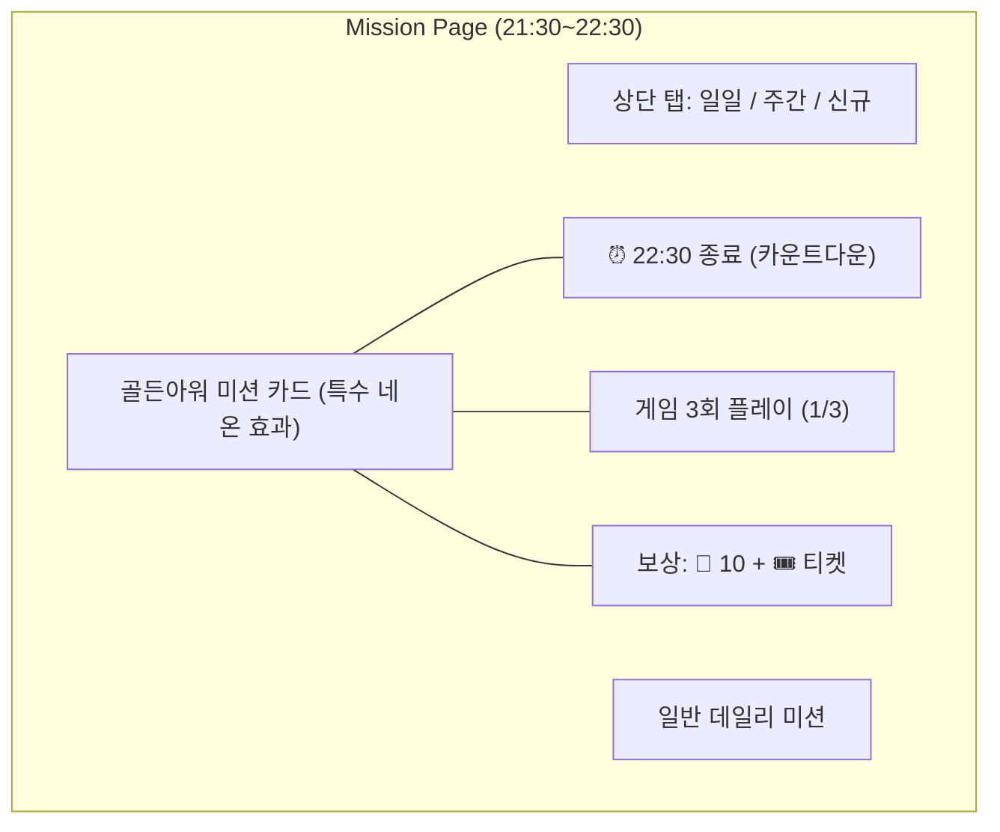
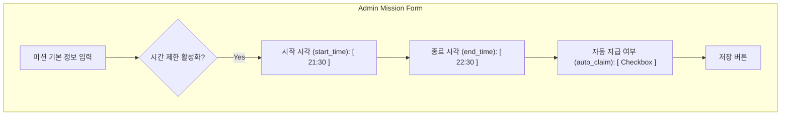

# 📄 골든아워(피크타임) 미션 동시 달성 이벤트 기술 구현 계획서

## 1. 개요
*   **이벤트명**: 골든아워(Golden Hour) 미션
*   **컨셉**: 매일 특정 피크타임(21:30~22:30)에 특정 행동(게임 3회 플레이) 달성 시 보상 지급.
*   **목적**: 유저 접속 시간 동기화 및 고착화(리텐션), 시즌패스 성장 촉진.
*   **주요 시스템 레버**: 
    *   `Mission (PLAY_GAME)`: 행동 트리거
    *   `Time-Window Filtering`: 시간대 제한 로직
    *   `Diamond/XP/Tickets`: 연동 보상

---

## 2. 엔터프라이즈 수준 평가 및 보강 요약
*   **강점**: UX/어드민/백엔드/운영/테스트/로드맵 전 영역을 커버하고 있어 기능 구현 가이드로는 충분.
*   **부족한 부분**: 번호 체계 불일치, 비기능 요구사항(NFR)·성능·보안·남용 방어, 시간대/시계 신뢰성, 배포·롤백·플래그 전략, 알림/자동화 운영 기준이 명시적이지 않음.
*   **이번 보강 범위**: (1) 섹션 번호 정리, (2) 안정성·보안·성능·운영 품질 섹션 추가, (3) 인시던트/롤백/플래그/레이트리밋/멱등/시간대 정책 명문화, (4) 모니터링/알람 요건 보강.

---

## 3. UI/UX 상세 설계 (Wireframes & UX Spec)

### 3.1 User App: 미션 탭 강조 (Golden Hour Mission Highlight)
유저에게 시각적 긴박함(Urgency)을 제공하기 위해 기존 `MissionCard`를 골든아워 전용 스타일로 커스터마이징합니다.

#### [와이어프레임: 미션 리스트]


#### [주요 UX 요소]
1.  **시각적 상징**: 카드 테두리에 골드/네온 그린 애니메이션 효과를 주어 일반 미션과 차별화.
2.  **카운트다운**: 텍스트 대신 `HH:MM:SS` 형태의 실시간 타이머를 카드 우측 상단에 배치.
3.  **알림(Badge)**: 이벤트 활성 시간 동안 하단 네비게이션 미션 아이콘에 'HOT' 또는 'EVENT' 뱃지 표시.
4.  **자동 팝업**: 21:30 접속 중인 유저에게 "골든아워가 시작되었습니다! 지금 플레이하고 2배 보상을 받으세요" 토스트 메시지 송출.

---

## 4. 어드민 관리 가이드 (Admin Tooling)

### 4.1 어드민 와이어프레임 (Admin Form)
기존 미션 등록 폼 하단에 '시간 제어' 섹션을 추가합니다.

#### [와이어프레임: 미션 등록/수정]


---

## 5. 백엔드 상세 구현 스펙 (Backend Deep-Dive)

### 5.1 시각 비교 로직 (Filtering Flow)
매우 정밀한 시각 비교를 위해 단순 문자열 비교가 아닌 파이썬 `time` 객체를 활용합니다.

```python
# app/services/mission_service.py 내 로직 흐름
def is_within_time_window(mission: Mission, now_kst: datetime) -> bool:
    if not mission.start_time or not mission.end_time:
        return True
    
    current_time = now_kst.time() # HH:MM:SS.mmmm
    return mission.start_time <= current_time <= mission.end_time
```

### 5.2 API 연동 규격
*   **GET `/api/mission/`**: 유저의 현재 시각이 미션 활성 범위 밖일 경우 목록에서 제외하거나 `is_locked=True` 상태로 내려주어 프론트에서 잠금 표시.
*   **POST `/api/mission/{id}/claim`**: 보상 수령 시점에 다시 한번 서버 타임존을 체크하여 유효 시간 접속 여부 최종 검증 (Anti-Abuse).

---

## 6. 관리 및 소통 가이드 (Operation & Communication)

### 6.1 운영 장애 대응 (Incident Handling)
*   **서버 시각 불일치**: 어드민 대시보드 메인에 "현재 서버 KST 시각"을 상시 노출하여 운영진이 육안으로 확인 가능하게 함.
*   **보상 미지급 문의**: 유저의 활동 로그(`action_at`)가 미션 범위 초단위 경계에 걸칠 경우, 서버 로그를 통해 판정 근거 확인.

### 6.2 텔레그램 공지 템플릿
> 🚀 **[CCJM] 골든아워 미션 시작!**
> 
> 지금부터 1시간 동안만 열리는 특별 미션!
> 🎮 게임 3판만 해도 다이아와 스탬프가 쏟아집니다.
> 
> ⏰ 시간: 21:30 ~ 22:30 (KST)
> 🎁 보상: 💎 10개 + 시즌패스 스탬프 1개
> 
> 지금 바로 접속하세요! [앱 열기]

---

## 7. DB 스키마 및 로직 수정 상세

### 7.1 초기 데이터 시딩 (Seeding)
이벤트 활성화를 위한 SQL 또는 시드 스크립트 설정값입니다.

*   **id**: (자동생성)
*   **title**: "🔥 골든아워: 게임 3회 플레이"
*   **description**: "21:30 ~ 22:30 사이 게임을 3번 즐기고 다이아와 스탬프 보너스를 받으세요!"
*   **logic_key**: `golden_hour_play_3`
*   **action_type**: `PLAY_GAME`
*   **target_value**: 3
*   **reward_type**: `DIAMOND`
*   **reward_amount**: 100
*   **xp_reward**: 500 (시즌 패스 1스탬프 분량)
*   **start_time**: `21:30:00`
*   **end_time**: `22:30:00`

---

## 8. 프론트엔드 UI/UX 사양

### 8.1 미션 카드 강조 (`EventDashboardPage.tsx`)
*   **이벤트 태그**: "시간 한정", "골든아워" 뱃지 노출.
*   **카운트다운/시간 표시**: 미션 설명 영역에 "21:30 ~ 22:30 한정" 텍스트 강조(Red/Gold 테마).
*   **상태 표시**: 활성 시간 외에는 "준비 중" 또는 비활성 처리, 활성 시간 내에는 "진행 중" 강조.

### 8.2 알림 (Push/Nudge)
*   21:30 시작 시점에 텔레그램 알림(Nudge) 발송 로직 검토 (기존 `NotificationService` 활용).

---

## 9. 풀스택 기술 스펙 (Full-Stack Specs)

기존 시스템의 가동성을 최대로 활용하고 파편화를 방지하기 위해 **기존 미션 관리 도구(Admin Mission Tool)**를 확장합니다.

### 9.1 Backend (Python/FastAPI/SQLAlchemy)
*   **Model**: `app/models/mission.py` 내 `Mission` 클래스에 `start_time: Time`, `end_time: Time`, `auto_claim: Boolean` 필드 추가.
*   **Schema**: `app/schemas/mission.py` 내 `MissionCreate`, `MissionUpdate` 모델에 위 필드 반영 (`Optional[datetime.time]`).
*   **Service**: `MissionService.update_progress` 내 시각 비교 로직 구현 및 `auto_claim=True`인 경우 즉시 보상 지급 함수 연계.

### 9.2 Frontend (React/TypeScript/Tailwind)
*   **Admin UI**: `src/admin/pages/AdminMissionPage.tsx` 내 `Form Overlay` 섹션 확장.
    *   `HTML5 Time Input` 활용: 별도의 라이브러리 없이 `<input type="time" />`을 사용하여 브라우저 표준 시간 선택기 제공.
    *   **목록 표시**: 관리 테이블에 `시작/종료 시각` 컬럼 추가하여 가시성 확보.
*   **Store/API**: `AdminMissionPayload` 인터페이스 및 `adminMissionApi.ts` 내 데이터 직렬화 로직 업데이트.

---

## 10. 관리 및 유지보수 계획 (Maintenance)

### 10.1 운영 효율화 (Minimal Ops)
*   **재활용**: 신규 페이지를 만들지 않고 기존 `SPECIAL` 카테고리 또는 전용 카테고리를 할당하여 관리합니다.
*   **배율 연동**: `VaultService`의 `vault_accrual_multiplier` 설정과 미션 시간을 일치시켜 수동 조작 실수를 방지합니다.

### 10.2 추적성 및 가시성 (Observability)
*   **변경 이력**: 기존 `AdminAuditLog` 시스템을 통해 누가 미션 시간이나 보상 수량을 변경했는지 기록합니다.
*   **실시간 모니터링**: 21:30~22:30 사이 `action_type='PLAY_GAME'` 로그 인입량과 `UserMissionProgress` 업데이트 성공률을 Grafana 또는 별도 어드민 대시보드에서 관측합니다.

---

## 11. 안정성·보안·성능·운영 품질 (NFR)
*   **시간/시계 정책**: 모든 비교는 KST `timezone-aware datetime` 기준. 앱 클라이언트 시각 신뢰 금지, 서버 시각은 NTP 2중 동기화 및 알림 배치 5분 전 헬스체크(시각 오차 ±1초 이내) 통과 시에만 실행.
*   **멱등·중복 방어**: `MissionProgress`는 `(user_id, mission_id, action_id)` 유니크 키로 중복 적립 방지. `claim_reward`는 트랜잭션 내부에서 상태 플래그 전이(`pending->claimed`)로 처리하고 재시도 가능하도록 설계.
*   **레이트 리밋/남용 방어**: `POST /api/mission/{id}/claim`에 IP+user 기반 레이트 리밋(예: 10 rps, 버스트 20) 적용, 실패 로그는 샘플링 10%만 저장. 자동 알림/토스트는 사용자당 하루 1회만 노출(플래그 `notified_at`).
*   **성능/용량 가정**: 피크타임 요청 2~3배 증가 가정. 미션 리스트 캐싱(60초) + `PLAY_GAME` 이벤트 큐 소비자 처리량(현재 대비 +50%) 확보. DB 인덱스: `action_at`, `mission_id`, `user_id` 복합 인덱스 점검.
*   **배포/플래그/롤백**: 기능 플래그 `golden_hour_enabled` + 시간 설정(환경 변수/어드민) 분리. 배포는 드라이런(비활성) → 프로덕션 활성 순서, 문제 발생 시 플래그 즉시 OFF 후 롤백(애플리케이션 배포 이전 버전) 경로 명시.
*   **데이터 품질/감사**: 어드민이 시간을 수정하거나 auto_claim을 변경하면 `AdminAuditLog`에 저장(필드: actor_id, before/after JSON, mission_id, requested_at). 일별 집계 리포트에 골든아워 플래그 미션의 완료/클레임/지급액을 분리 노출.
*   **장애 대응/비상 운전**: 시각 비교 오류나 외부 시간 소스 장애 시 `is_within_time_window`가 `False`를 기본값으로 반환하여 과지급을 막고, 운영 플래그로 수동 강제 지급(대상자 CSV 업로드) 경로 유지.

---

## 12. 검증 및 안착 계획 (Verification & Rollout)

### 12.1 기술 검증 (Technical Verification) - Pytest
단순 성공/실패 외에 경계값 및 예외 상황을 포함한 5종 테스트 케이스를 구축합니다.
1.  **시간 경계값 테스트 (Boundary)**: 21:30 정각, 22:30 정간에 미션 데이터가 정확히 기록되는지 확인.
2.  **Mocking Time 시나리오**: `freezegun` 등을 활용하여 시스템 시각을 고정하고, `update_progress` 필터링 로직이 `time` 객체 비교를 정확히 수행하는지 검증.
3.  **멱등성 및 중복 방지 (Idempotency)**: 동일한 게임 세션에 대해 중복 적립이 발생하지 않는지 `UserMissionProgress` 유니크 제약 조건 확인.
4.  **보정 로직 테스트**: 미션 완료 후 `claim_reward` 호출 시 `Inventory` 및 `Wallet`에 즉시 반영되는지 데이터 일관성 체크.
5.  **다중 미션 동시 달성**: 일반 데일리 미션(예: 게임 10회)과 골든아워 미션(게임 3회)이 동시에 카운트되는지 확인.

### 12.2 운영 검증 (Operational Verification)
실제 배포 전/후 운영팀이 수행해야 할 체크리스트입니다.
*   **어드민 설정 검증**: `AdminMissionPage`에서 `start_time`, `end_time` 입력 시 KST 시각이 DB에 정확한 포맷(`HH:MM:SS`)으로 저장되는지 상호보완적 확인.
*   **팝업/뱃지 노출 확인**: 활성 시간 진입 전(21:25)과 후(21:35) 프론트엔드 UI 변경 사항 실시간 모니터링.
*   **텔레그램 넛지(Nudge) 연동**: 이벤트 시작 시점에 대상자(최근 3일 접속 유저)에게 알림이 정상 발송되는지 소수 세그먼트 대상 선행 테스트.
*   **로그 가독성**: `VaultEarnEvent` 및 `MissionLog`에 'Golden Hour' 태그가 남는지 확인하여 CS 발생 시 추적 가능성 확보.

### 12.3 성과 측정 및 리텐션 분석 (Impact Analysis)
이벤트가 리텐션과 입금에 기여하는지 데이터로 입증합니다.
*   **CCU 동기화 지표**: 21:30~22:30 사이의 평균 동시 접속자 수(CCU)가 비이벤트 시간대 대비 얼마나 상승했는지 측정.
*   **입금 전환율 (Deposit CR)**: 골든아워 참여 유저 중 미션 보상 소진 후 2시간 내에 추가 입금(CC 충전)을 진행한 유저 비중 분석.
*   **금고 인플레이션 감시**: 2배 적립(Multiplier)으로 인해 시장에 풀리는 포인트 총량이 시스템 허용치 내에 있는지 일일 정산 리포트 출력.

---

## 13. 단계별 실행 로드맵
1.  **D-Day -3**: 로컬/스테이지 환경 DB 마이그레이션 (`start_time`, `end_time` 추가).
2.  **D-Day -2**: 백엔드 필터링 로직 배포 및 단위 테스트 완료.
3.  **D-Day -1**: 어드민 미션 생성 및 프론트엔드 UI 반영 (비활성 상태로 선배포).
4.  **D-Day**: 21:30 이벤트 활성화 및 텔레그램 공지 송출.
5.  **D+Day 1**: 첫날 로그 분석 및 보상 밸런싱 조정.

---

## 14. 구현 체크리스트 (진행 현황)
- [x] 기능 플래그 추가: `GOLDEN_HOUR_ENABLED` (기본 off)
- [x] 레이트리밋 설정: `GOLDEN_HOUR_CLAIM_RATE_RPS`=10, `GOLDEN_HOUR_CLAIM_RATE_BURST`=20 (API 단 적용)
- [x] 멱등키 요구: `POST /api/mission/{id}/claim`에 `X-Idempotency-Key` 필수, TTL=600초
- [x] 골든아워 미션 게이팅: flag off 시 리스트/업데이트/클레임 모두 차단
- [x] 미션 타임 윈도우 필드 및 체크: `start_time`/`end_time` + KST 비교 적용, 윈도우 밖 리스트/클레임 차단
- [x] Auto-claim: `auto_claim=True` 미션 완료 시 즉시 보상 시도
- [x] NTP/시계 드리프트 프리플라이트: 알림·넛지 전송 시 허용 오차 ±1s 이내일 때만 수행
- [x] Prometheus 노출: `/metrics` 엔드포인트 및 mission_claim / ntp_preflight / notification 메트릭 추가
- [x] Grafana 대시보드/알람 초안 작성: [docs/06_ops/events/20260104_golden_hour_grafana.md](docs/06_ops/events/20260104_golden_hour_grafana.md)
- [x] 분산 레이트리밋/멱등성: Redis URL 설정 시 Redis 백엔드 사용, 미설정 시 인메모리 fallback
- [x] DB 마이그레이션 생성: mission.start_time/end_time/auto_claim 컬럼 추가(Alembic)
- [x] 어드민 UI 반영: start/end/auto_claim 입력 필드 및 테이블 표시 (AdminMissionPage)
- [x] 유저 UI 반영: 미션 카드에 시간 창/Auto-Claim 뱃지 노출 (MissionCard)
- [x] 클라이언트 멱등키 전송: 미션 보상 요청에 X-Idempotency-Key 자동 부착 + vitest 커버
- [x] 프론트엔드 유닛 테스트 실행: `npm run test` (vitest) 통과
- [ ] 배포/플래그 운영 플레이북: 플래그 온/오프 절차 및 롤백 명시 (문서화 필요)
- [x] 자동 테스트: 경계시간/멱등/429/409/flag off 시나리오 Pytest 작성 및 실행 (추가 커버리지 필요)
