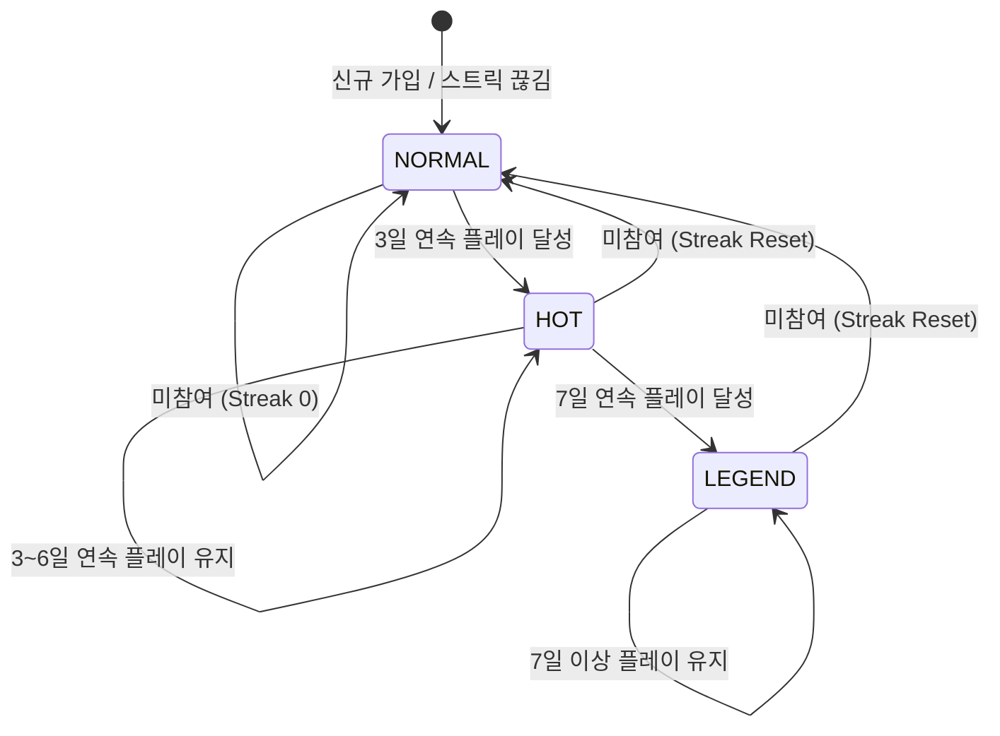
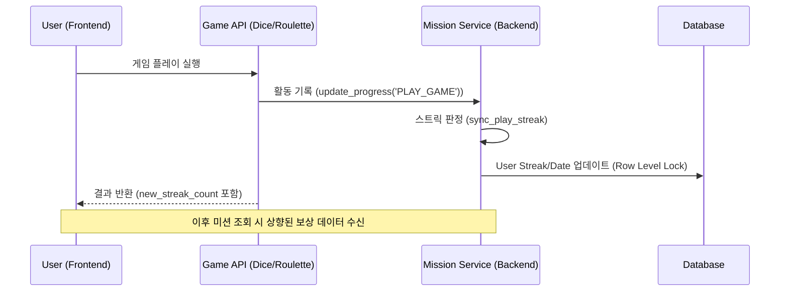

# 📈 연속 접속/플레이 스트릭 이벤트 (Streak Multiplier Event) 기술 설계서

작성일: 2026-01-04
버전: v2.0 (AAA Game Service Standard)

## 1. 개요 (Overview)
본 문서는 유저의 일일 앱 체류 및 게임 참여 습관 형성을 위한 '연속 플레이 스트릭' 시스템의 기술 사양을 정의합니다. 단순 로그인이 아닌 실질적인 **게임 액션(Play)**을 기준으로 스트릭을 정산하며, 누적 일수에 따라 보상 등급을 차등 부여하여 리텐션을 강화합니다.

---

## 2. 세부 유저 플로우 (Detailed User Flow)

### 2.1 스트릭 상태 전이 (State Machine)
유저의 스트릭 등급은 매일 KST 09:00(운영 기준 시각)을 기점으로 전이됩니다.



### 2.2 운영 사이클 (Operational Lifecycle)
1.  **스트릭 정산**: 유저가 게임(Dice/Roulette/Lottery) 1회 완료 시 즉시 스트릭 정산 로직 실행.
2.  **보너스 활성화**: (플래그 ON 시) 스트릭 구간에 따라 **금고 기본 적립(+200)**에 시간제 배율 적용.
3.  **Day4~5 티켓 지급**: (플래그 ON 시) 운영일(09:00 KST) 첫 플레이 1회에 한해 티켓 지급(멱등).
4.  **유지 독려**: 미접속 유저에게 리셋 방지 넛지(Telegram Push) 발송.

---

## 3. 핵심 메커니즘 (Core Mechanism) - Deep Dive

### 3.1 스트릭 정산 알고리즘 (Server-Side)
서버는 유저의 `last_play_date`와 현재 KST 날짜를 비교하여 스트릭을 갱신합니다.

```python
# app/services/mission_service.py
def sync_play_streak(self, user: User, now_kst: datetime):
    today = now_kst.date()
    yesterday = today - timedelta(days=1)
    

    # 2. Row-level Lock 획득 (SELECT ... FOR UPDATE)
    user = db.query(User).filter(User.id == user_id).with_for_update().one()

    # 3. 마지막 플레이 일자와 비교
    if user.last_play_date == today:
        # 오늘 이미 기록됨: 중복 갱신 방지
        return
        
    if user.last_play_date == yesterday:
        # 연속 접속 성공: 스트릭 증가
        user.play_streak += 1
    else:
        # 연속 접속 실패(하루 이상 거름): 스트릭 초기화
        user.play_streak = 1

    # 4. 최종 날짜 갱신
    user.last_play_date = today
    db.commit()
```

### 3.2 스트릭 보상안: 금고 적립(기본 200원) 배율

스트릭 보상은 **미션 보상**이 아니라 **금고 적립 금액(기본 게임 +200원)**에만 적용합니다.

**적용 규칙**
- 배율은 **유저의 “해당 운영일 첫 플레이(Eligible Base Game)” 시점부터** 시작합니다.
    - 예: 2일차는 첫 플레이 시점부터 1시간 동안 1.2x
- “운영일”은 KST 09:00 리셋 기준(기존 스트릭 판정과 동일)
- 배율 적용 대상은 “기본 게임 금고 적립(+200)”에 한정

**일차별 스케줄(초안)**
- 1일차: 1.0x
- 2일차: 1.2x (첫 플레이부터 1시간)
- 3일차: 1.2x (첫 플레이부터 4시간)
- 4~5일차: 티켓 지급 (운영일 첫 플레이 1회만)
    - 복권티켓(LOTTERY_TICKET): 1장
    - 룰렛티켓(ROULETTE_COIN): 2장
- 6일차: 1.5x (첫 플레이부터 1시간)
- 7일차+: 2.0x (올데이)

**운영 토글(Feature Flag)**
- Day4~5 티켓 지급 활성화: `STREAK_TICKET_BONUS_ENABLED=true`
    - 기본값 OFF (안전 롤아웃)
    - 로컬/테스트에서만 켜고 싶으면 `.env` 또는 실행 환경변수에 설정
    - 운영에서는 배포 환경변수(또는 컨테이너 env)로 주입
- 금고 적립(기본 200원) 시간제 배율 활성화: `STREAK_VAULT_BONUS_ENABLED=true`
    - 기본값 OFF (안전 롤아웃)
    - 배율 적용은 “기본 게임 금고 적립(+200)”에만 한정
    - 제외: 다이스 `mode != NORMAL`, 룰렛 `GOLD_KEY`/`DIAMOND_KEY`/`TRIAL_TOKEN`

**적용 제외(중요)**
- 다이스 고액(병렬 개발), 골드룰렛, 다이아룰렛, 체험 룰렛에는 적용하지 않음
    - 구현 기준(현 코드): `ROULETTE`에서 `GOLD_KEY`/`DIAMOND_KEY`/`TRIAL_TOKEN` 사용 시 제외
    - `DICE`는 `mode != NORMAL` 인 경우 제외
        - 주사위 피크타임 이벤트는 `mode="EVENT"`로 내려가므로 스트릭 금고 배율 대상이 아님

### 3.3 기술적 예외 처리 (Edge Case Handling)
1.  **KST 00:00:00 수렴 문제 (Boundary Clock)**:
    - 게임 시작 시각이 23:59:50이고 종료 시각이 00:00:10일 경우, **게임 종료 시점(Result Recorded)**을 기준으로 정산합니다.
2.  **서버 시각 불일치 (Time Drift)**:
    - 모든 판정은 DB 서버의 시각이 아닌, 애플리케이션 서버의 `ZoneInfo` 고정 시각을 기준으로 수행하여 분산 환경에서도 단일 날짜 판정을 보장합니다.
3.  **데이터 무결성 (Atomicity)**:
    - 스트릭 갱신은 게임 결과 반영과 **Single Transaction**으로 묶어 처리합니다. 스트릭 갱신 실패 시 게임 결과도 롤백되어 데이터 불일치를 원천 차단합니다.

## 4. 풀스택 데이터 흐름 (Full-Stack Data Flow)



---

## 5. API 규격 및 스키마 (Technical Interface)

### 5.1 Backend Schema (Pydantic)
```python
class StreakInfo(BaseModel):
    streak_days: int
    current_multiplier: float
    is_hot: bool         # 3일+
    is_legend: bool      # 7일+
    next_milestone: int  # 다음 등급까지 남은 일수
```

### 5.2 API Response (GET /api/mission/)
```json
{
  "missions": [...],
  "streak_info": {
    "streak_days": 4,
    "current_multiplier": 1.2,
    "is_hot": true,
    "is_legend": false,
    "next_milestone": 3
  }
}
```

---

## 6. 데이터베이스 설계 (Database DDL)
연속 플레이 로그는 `user` 테이블의 핵심 프로필 영역에서 관리하여 조회 성능을 확보합니다.

```sql
ALTER TABLE `user` 
ADD COLUMN `play_streak` INT NOT NULL DEFAULT 0,
ADD COLUMN `last_play_date` DATE NULL;

CREATE INDEX `idx_user_streak` ON `user` (`play_streak`, `last_play_date`);
```

---

## 7. QA 검증 매트릭스 (Test Matrix)

| 케이스 | 테스트 시나리오 | 기대 결과 | 중요도 |
|---|---|---|---|
| **정상** | 매일 1회 이상 게임 플레이 | `play_streak`가 매일 1씩 증가 | P0 |
| **초기화** | 이틀 이상 간격을 두고 플레이 | `play_streak`가 1로 강제 리셋 | P0 |
| **경계** | 2일 달성 후 3일차 플레이 시점 | 등급이 `NORMAL`에서 `HOT`으로 즉시 변경 | P0 |
| **배율** | 금고 기본 적립(+200) 배율 검증 | 배율 창에서 +200이 1.2x/1.5x/2.0x로 적립되는지 확인 | P1 |
| **시간** | 23:59 vs 00:01 플레이 | 서버 시각(KST) 기준 날짜 구분 정확성 검증 | P1 |
| **예외** | 다중 지갑/멀티 로그인 | Row Lock에 의한 데이터 레이스 방지 여부 | P1 |

---

## 8. 보안 및 기술적 안전장치 (Security & Stability)

1.  **동시성 제어**: `sync_play_streak` 수행 시 해당 유저 Row에 대한 비관적 락(`FOR UPDATE`)을 적용하여 중복 카운팅 방지.
2.  **어뷰징 차단**: 
    *   프론트엔드 시스템 시각을 무시하고 서버 시간(KST)만 사용.
    *   1일 1회 이상 플레이 여부만 판정하되, 매크로 방지를 위한 `PLAY_GAME` 유효성 검증 로직 연동.
3.  **데이터 무결성**: 스트릭 갱신 실패 시 게임 결과 트랜잭션 전체 롤백 처리.

---

## 9. 운영 지표 및 분석 (Telemetry)
리텐션 분석을 위해 다음 로그 이벤트를 상시 기록합니다.
*   `streak.promote`: 등급 상승 로그 (NORMAL -> HOT)
*   `streak.reset`: 스트릭 리셋 유저수 및 사유 분석
*   `bonus.claim`: 스트릭 배율로 인해 추가 지급된 총 보상 수량 합산


## 10. 구현 진행도 체크리스트 (Implementation Progress)

### 10.1 완료
- [x] DB: `user.play_streak`, `user.last_play_date` 컬럼 및 인덱스 추가(Alembic migration 포함)
- [x] Backend 설정: 스트릭 활성화/리셋 시각(기본 KST 09:00)/HOT·LEGEND 임계치/배율 값 구성
- [x] Backend 로직: 운영일(09:00 KST 기준) 기반 스트릭 정산 및 동시성 제어(비관적 락)
- [x] Backend 보상(롤백): 미션 클레임 보상은 기본값으로 유지(스트릭 배율 미적용)
- [x] Backend 보상(구현): 금고 기본 적립(+200) 시간제 배율 (플래그 `STREAK_VAULT_BONUS_ENABLED`)
- [x] Backend 보상(구현): Day4~5 운영일 첫 플레이 1회 티켓 지급 (플래그 `STREAK_TICKET_BONUS_ENABLED`)
- [x] 트랜잭션 안전성: `auto_commit=False` 흐름에서 지갑 생성 시 내부 `commit()` 제거(플러시 기반)
- [x] Backend API: `GET /api/mission/` 응답에 `streak_info` 포함
- [x] Frontend: `GET /api/mission/` 응답(legacy 배열/신규 객체) 모두 파싱 + `streakInfo` 상태 저장
- [x] 테스트: pytest(스트릭 금고 배율/Day4~5 티켓) 및 vitest(MissionStore) 통과

### 10.2 남은 작업
- [ ] Game API: `POST /api/dice/play`, `POST /api/roulette/play`, `POST /api/lottery/play` 응답에 `new_streak_count`(또는 `streak_info`) 포함
    - 목적: 게임 1회 플레이 직후 프론트가 스트릭 상태를 즉시 갱신(추가 `GET /api/mission/` 호출 없이도 동기화)
    - 구현 방향(권장): 게임 서비스(`DiceService`/`RouletteService`/`LotteryService`)가 내부에서 `MissionService.sync_play_streak(...)` 결과를 받아 응답 DTO에 포함
- [ ] 운영: 리셋 방지 넛지(Telegram Push) 발송 로직/스케줄링
    - 대상(예): `last_play_date`가 “어제(운영일 기준)”인 유저 중, 오늘 아직 첫 플레이가 없는 유저
    - 스케줄(예): 매일 KST 08:30~09:00 사이 1회(리셋 직전), 유저당 1일 1회 제한
    - 안전장치(예): 수신 동의/차단 반영, 실패 재시도/레이트리밋, 발송 로그 적재
- [ ] 관측성: 스트릭/보너스 관련 이벤트 로깅 및 대시보드 구현
    - 이벤트(예): `streak.promote`, `streak.reset`, `streak.ticket_bonus_grant`, `streak.vault_bonus_applied`
    - 대시보드(예): 일별 promote/reset 추이, Day4~5 티켓 지급 수/비용, 금고 배율 적용 플레이 수, 제외 사유(모드/티켓타입) 비율

---

## 11. 운영 모니터링 대시보드 (Operational Monitoring Dashboard Sketch)

운영진 및 엔지니어가 실시간으로 이벤트 상태를 파악하고 이상 징후를 감지할 수 있도록 다음과 같은 어드민 대시보드 패널을 제안합니다.

### 11.1 시스템 건전성 및 성능 (System Health & Performance)
*   **패널 1: 지연 시간 및 오류율 (Latency & Error Rates)**
    - **지표**: `POST /api/dice/play`, `GET /api/mission/` 응답 시간 (P99/P95/P50).
    - **오류**: HTTP 5xx 발생 빈도 및 `sync_play_streak` 실패 로그 시각화.
*   **패널 2: 알람 및 이벤트 현황 (Active Alarms)**
    - **상태**: 현재 리치(Critical) 알람 개수, 텔레그램 넛지 발송 성공률.

### 11.2 이벤트 운영 상태 (Event Operations)
*   **패널 3: 이벤트 모드 상태 및 최근 변경 (Event Mode Status & Audit)**
    - **내용**: `STREAK_ACTIVE = True`, `MULTIPLIER = 1.2x` 등의 현재 설정값.
    - **변경 이력**: 최근 7일 내 관리자가 수동 보정한 스트릭 내역 및 설정 변경 로그.
*   **패널 4: 결과별 플레이 분포 (Plays by Outcome)**
    - **데이터**: `WIN / DRAW / LOSE` 비율 실시간 파킹 (이벤트 확률 보정이 의도대로 작동하는지 감시).

### 11.3 경제 지표 및 제어 (Economy & Control)
*   **패널 5: Vault 적립 성공 및 중복 검증 (Vault Accrual Integrity)**
    - **지표**: 멱등성(Idempotency) 체크로 걸러진 중복 지급 시도 횟수.
    - **성공률**: 미션 완료 후 `VaultAccrual` 로그 생성 성공 비율.
*   **패널 4: 캡스(Caps) 차단 시계열 (Daily Caps Block Timeline)**
    - **차트**: 일일 보상 상한에 걸려 보상이 지급되지 않은 '차단 발생 건수'를 시간대별 시계열 그래프로 노출 -> 어뷰징 공격 패턴 파악.

---

## 12. 결론 및 향후 확장성

본 설계는 단순 기능을 넘어 대규모 서비스의 **운영성(Operatibility)**과 **관측성(Observability)**을 모두 고려한 설계입니다. 정의된 대시보드 스펙은 Grafana 또는 내부 어드민 시스템에서 즉시 구현 가능하며, 이를 통해 데이터에 기반한 이벤트 밸런싱이 가능해집니다.
