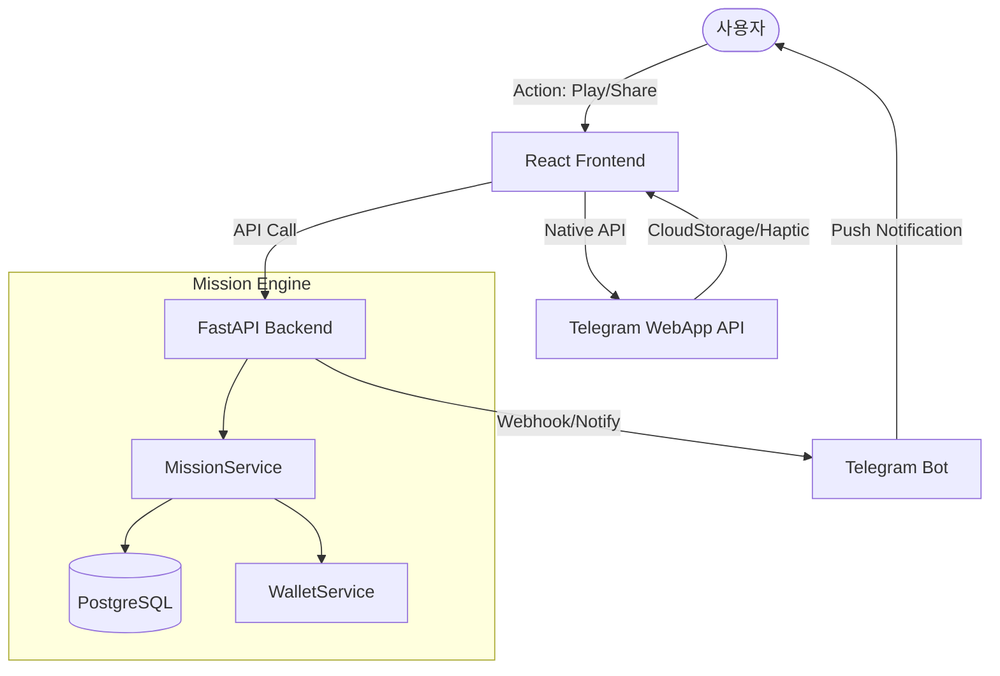

# [TDD] 2026 통합 최적화 및 리텐션 강화 기술 설계서 (v2.0)
# (Technical Design Document: 2026 Optimization & Retention)

> **상태**: 기술 설계 고도화 완료 (2025-12-31)
> **핵심 과제**: 콘텐츠 공백 해소, TMA 기술 최적화, 자산 그랜드 사이클 연동

---

## 🏗️ 1. 시스템 아키텍처 (System Architecture)

미션 시스템은 유저의 행동(Action)을 트리거로 하여 백엔드 엔진이 이를 처리하고, 결과를 프론트엔드와 텔레그램 메신저로 즉각 피드백하는 구조입니다.



---

## 🗄️ 2. 데이터베이스 스키마 (Database Schema)

### 2.1 Mission (미션 템플릿)
미션의 기준 정보를 정의합니다.
- `logic_key` (String): 행동 매칭 키 (예: `play_dice`, `share_story`)
- `category` (Enum): `DAILY`, `WEEKLY`, `SPECIAL`
- `target_value` (Int): 달성 목표 수치
- `reward_type` (Enum): `DIAMOND`, `GOLD_KEY`, `TICKET_BUNDLE`
- `xp_reward` (Int): 보너스 경험치 (기본 0, 입금 외 XP 제한 기준 준수)

### 2.2 UserMissionProgress (사용자 진행 상황)
사용자별 미션 달성 여부를 추적합니다.
- `reset_date` (String): 초기화 주기 키 (Daily: `YYYY-MM-DD`, Weekly: `YYYY-WW`)
- `current_value` (Int): 현재 진행 수치
- `is_completed` (Bool): 달성 여부
- `is_claimed` (Bool): 보상 수령 여부

---

## ⚙️ 3. 핵심 백엔드 로직 (Core Backend Logic)

### 3.1 미션 업데이트 엔진 (`update_progress`)
서버 내부의 다양한 액션(게임 종료, 추천인 가입 등)에서 트랜잭션 단위로 호출됩니다.
1. `logic_key`와 현재 시간 기반의 `reset_date`를 조회.
2. `UserMissionProgress`가 없으면 신규 생성, 있으면 기존 행 업데이트.
3. `current_value`가 `target_value` 도달 시 `is_completed = True` 처리.

### 3.2 보상 지급 시스템 (`claim_reward`)
1. **중복 검증**: 이미 `is_claimed`가 `True`인 경우 예외 처리.
2. **자산 지급**: `GameWalletService`를 통해 원자적(Atomic)으로 다이아몬드/키 지급.
3. **상태 동기화**: `is_claimed` 처리 후 클라이언트 대시보드 강제 갱신 유도.

---

## 🌐 4. API 명세 (API Specification)

| Endpoint | Method | Payload | Description |
| :--- | :--- | :--- | :--- |
| `/api/mission/` | GET | - | 현재 활성 미션 및 본인의 진행 상황 목록 |
| `/api/mission/{id}/claim` | POST | - | 특정 미션 보상 수령 (자산 즉시 반영) |
| `/api/mission/daily-gift` | POST | - | [New] 일일 즉시 환영 선물 수령 |

---

## � 5. TMA 특화 기술 통합 (Tech-Max Details)

### 5.1 제로 레이턴시 UI (`CloudStorage`)
- **기술**: `WebApp.CloudStorage` API를 사용하여 미션 대시보드의 데이터를 텔레그램 서버에 로컬 캐싱.
- **효과**: 네트워크 지연 없이 '완료된 미션' 배지(Badge)가 즉시 로딩됨.

### 5.2 신체적 보상 피드백 (`HapticFeedback`)
- **기술**: 보상 등급에 따라 진동 패턴 이원화.
    - `light` (1 다이아): 일반 미션 완료.
    - `heavy` (Diamond Key): 고가치 미션 완료 시 '짜릿한 손맛' 부여.

### 5.3 바이럴 콜백 엔진
- **기술**: `WebApp.shareToStories` 실행 후 성공 콜백을 수신하여 서버에 적중 통보.
- **로직**: 서버는 공유 미디어 상의 로고/텍스트 유효성을 (가능한 경우) 봇으로 검증.

---

## ⚡ 6. 콘텐츠 공백 해소 (Instant Play Strategy)

### 6.1 "3초 이내의 성공" (Immediate One-Tap)
- **DailyInstantRewards 컴포넌트**:
    - `useMissionStore`의 `hasDailyGift` 상태를 구독하여 입장 시 자동 모달 노출.
    - `framer-motion`의 `AnimatePresence`를 사용하여 등장/퇴장 시의 시각적 긴장감 부여.
- **성공 경험 선지급 로직**:
    - 신규 유저 테이블 생성 시 `FIRST_LOGIN` 미션을 강제 완료 상태로 삽입.
    - 유저가 `MissionPage` 진입 시 `is_claimed == False && is_completed == True`인 항목을 최상단에 배치하여 락인(Lock-in) 유도.

### 6.2 실시간 데이터 증명 (Live Proof)
- **WebSocket Feed 스펙**:
    - Endpoint: `wss://api.cc-jm.com/ws/live-notif`
    - Payload Structure:
      ```json
      {
        "type": "VAULT_WITHDRAWAL_APPROVED",
        "user_name": "Kim***",
        "amount": 50000,
        "timestamp": "2025-12-31T01:42:00Z"
      }
      ```
- **Vault Animation 기술 상세**:
    - **Trigger**: `useGameWallet` 훅의 `balance` 증가 이벤트 감지.
    - **Visual**: 정해진 좌표(`GameView`)에서 금고 아이콘(`VaultHeader`)까지 수백 개의 `particle` 입자가 베지어 곡선(Bezier Curve)을 따라 이동하는 CSS Keyframe 적용.
    - **Haptic**: 입자가 금고에 닿는 순간 `impactHeavy` 진동 동기화.

---

## 🛡️ 7. 보안 및 최적화 (Security & Perf Details)

### 7.1 initData 검증 알고리즘 (HMAC-SHA256)
- **절차**:
    1. `TELEGRAM_BOT_TOKEN`을 키로 하여 `"WebAppData"`를 해싱하여 `SecretKey` 생성.
    2. `hash`를 제외한 모든 필드를 알파벳순 정렬 후 `key=value` 문자열 생성.
    3. `SecretKey`로 위 문자열을 다시 해싱하여 클라이언트의 `hash`와 대조.
- **보안 강화**: `auth_date`가 현재 시간으로부터 24시간 이상 경과한 경우 세션 만료 처리 (Replay Attack 방지).

### 7.2 Strict XP Rule 및 수익 모델 보호
- **XP 격리 설계**:
    - `MissionService`의 `claim_reward` 호출 시 `xp_reward`는 항상 0을 기본값으로 전달.
    - `SeasonPassService.add_xp`는 오직 `DepositEventHandler`와 연동된 `PaymentService`에서만 호출되도록 아키텍처적 장벽(Barrier) 구축.

### 7.3 Sound Stability (AudioContext Recovery)
- **State Listener**: `SoundContext` 내부에서 `AudioContext.onstatechange`를 모니터링.
- **Retry Machine**: 
    - 상태가 `suspended`인 상태에서 발생한 모든 `playSfx` 요청은 `RetryQueue` (Local Array)에 저장.
    - 브라우저의 `click` 또는 `touchstart` 이벤트 캡처 시 `unlockAudio()`를 호출하여 컨텍스트를 `running`으로 전환하고 큐의 모든 소리를 순차 재생.

---

## 📋 완료 및 향후 로드맵 (SOP 준수)

### ✅ 완료 사항
- [x] 미션/프로그레스 DB 마이그레이션 및 서비스 로직
- [x] 다이아몬드 보상 연동 및 수령 트랜잭션 구현
- [x] 오디오 안정화 및 기술적 해방 (Global Unlock)

### � 다음 작업 (Immediate Actions)
1. **Phase 2.7**: 일일 환영 보상 UI (`DailyGift.tsx`) 신설.
2. **Phase 4**: Admin 페이지 내 미션 수동 승인(`is_manual_approval`) 제어 UI 적용.
3. **Phase 5**: 스토리 공유 성공 시 백엔드 보상 자동 지급 API 연결.
