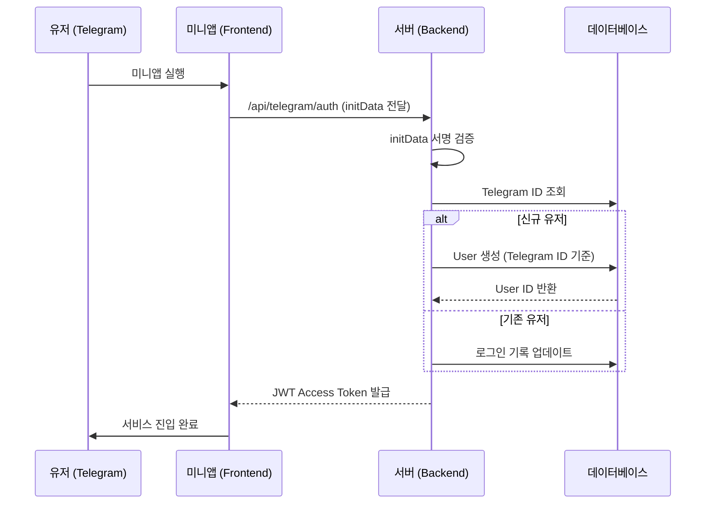

# 2026!! Daily Mission System v3 (Telegram-Only)

본 문서는 2026년 1월 1일부로 시행될 **텔레그램 전용(Telegram-Only) 생태계** 전환 설계를 담고 있습니다. 기존의 하이브리드(일반 로그인 + 텔레그램 연동) 방식을 폐기하고, 모든 유저 관리를 텔레그램 기반으로 일원화합니다.

---

## 1. 개편 핵심 요약 (Change Log v3)

- **인증 방식 통합**: ID/비밀번호 로그인을 완전히 제거하고, 텔레그램 `initData` 기반의 자동 가입/로그인으로 일원화.
- **데이터베이스 리셋**: 12/31 23:59:59를 기점으로 기존 유저 데이터를 아카이빙하고, 1/1 00:00부터 텔레그램 계정 기반 신규 데이터로 시작.
- **기능 단순화**: '수동 연동(Manual Link)', '매직 링크(Bridge Token)' 등 복잡한 전환 로직 삭제.
- **텔레그램 네이티브**: 미니앱 접속 즉시 유저 식별 및 서비스 이용 가능.

---

## 2. 회원 시스템 및 인증 Flow

### 2.1 텔레그램 싱글 사인온 (Single Sign-On)
미니앱이 실행될 때 전달되는 `initData`를 사용하여 서버에서 즉시 인증을 수행합니다.

### 2.2 유저 식별자 정의
- **Primary Key**: `user.id` (내부 DB용)
- **Unique Identifier**: `user.telegram_id` (텔레그램 고유 숫자 ID)
- **Display Name**: `user.nickname` (텔레그램 username 또는 "User_[TG_ID]")

---

## 3. 1/1 리셋 및 전환 전략 (Migration)

### 3.1 타임라인
- **12/31 20:00**: 기존 유저 마무리 보상 지급 및 안내 공지 (팝업/메시지).
- **12/31 23:50**: 서비스 점검 모드 전환.
- **12/31 23:59**: 기존 `users` 및 `vault` 데이터 백업 및 리셋.
- **1/1 00:01**: v3 서버 배포 (텔레그램 전용 모드) 및 서비스 오픈.

### 3.2 운영 방침
- **기존 재화**: 12/31 마감 이후 소멸 (사전 공지 필수).
- **어드민 대응**: 텔레그램 계정을 분실하거나 변경한 유저를 위해 어드민에서 `telegram_id`를 수동으로 매핑할 수 있는 기능 유지.

---

## 4. 백엔드/프런트엔드 주요 변경 예정 사항

### Backend
- `auth_router`에서 일반 ID/PW 로그인 엔드포인트 비활성화.
- `telegram_router`에서 `manual-link` 등 연동 관련 복잡 로직 제거.
- `User` 모델에서 `hashed_password` 필드 등 불필요한 필드 정리 (선택 사항).

### Frontend
- `/login` 페이지를 텔레그램 로고와 함께 "인증 중..." 상태를 보여주는 로딩 페이지로 대체.
- 연동 팝업이나 설정 메뉴의 "계정 연동" 섹션 삭제.

---

## 5. 보안 및 관리 정책
- **initData 검증**: 매 요청마다 또는 토큰 갱신 시 `hash` 검증을 수행하여 데이터 위변조 방지.
- **어드민 식별**: 어드민 페이지에서도 모든 유저를 텔레그램 닉네임과 ID로 조회 및 관리.
