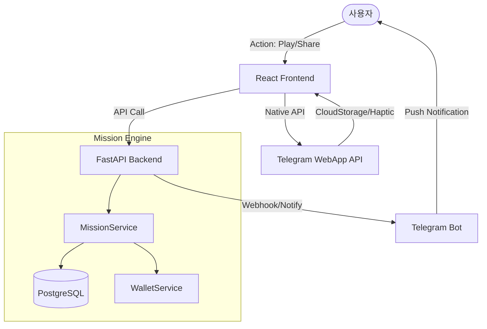

# [TDD] 2026 통합 최적화 및 리텐션 강화 기술 설계서 (v2.0)
# (Technical Design Document: 2026 Optimization & Retention)

> **상태**: 기술 설계 고도화 완료 (2025-12-31)
> **핵심 과제**: 콘텐츠 공백 해소, TMA 기술 최적화, 자산 그랜드 사이클 연동

---

## 🏗️ 1. 시스템 아키텍처 (System Architecture)

미션 시스템은 유저의 행동(Action)을 트리거로 하여 백엔드 엔진이 이를 처리하고, 결과를 프론트엔드와 텔레그램 메신저로 즉각 피드백하는 구조입니다.

---

## 🗄️ 2. 데이터베이스 스키마 (Database Schema)

### 2.1 Mission (미션 템플릿)
미션의 기준 정보를 정의합니다.
- `logic_key` (String): 행동 매칭 키 (예: `play_dice`, `share_story`)
- `category` (Enum): `DAILY`, `WEEKLY`, `SPECIAL`
- `target_value` (Int): 달성 목표 수치
- `reward_type` (Enum): `DIAMOND`, `GOLD_KEY`, `TICKET_BUNDLE`
- `xp_reward` (Int): 보너스 경험치 (기본 0, 입금 외 XP 제한 기준 준수)

### 2.2 UserMissionProgress (사용자 진행 상황)
사용자별 미션 달성 여부를 추적합니다.
- `reset_date` (String): 초기화 주기 키 (Daily: `YYYY-MM-DD`, Weekly: `YYYY-WW`)
- `current_value` (Int): 현재 진행 수치
- `is_completed` (Bool): 달성 여부
- `is_claimed` (Bool): 보상 수령 여부

---

## ⚙️ 3. 핵심 백엔드 로직 (Core Backend Logic)

### 3.1 미션 업데이트 엔진 (`update_progress`)
서버 내부의 다양한 액션(게임 종료, 추천인 가입 등)에서 트랜잭션 단위로 호출됩니다.
1. `logic_key`와 현재 시간 기반의 `reset_date`를 조회.
2. `UserMissionProgress`가 없으면 신규 생성, 있으면 기존 행 업데이트.
3. `current_value`가 `target_value` 도달 시 `is_completed = True` 처리.

### 3.2 보상 지급 시스템 (`claim_reward`)
1. **중복 검증**: 이미 `is_claimed`가 `True`인 경우 예외 처리.
2. **자산 지급**: `GameWalletService`를 통해 원자적(Atomic)으로 다이아몬드/키 지급.
3. **상태 동기화**: `is_claimed` 처리 후 클라이언트 대시보드 강제 갱신 유도.

---

## 🌐 4. API 명세 (API Specification)

| Endpoint | Method | Payload | Description |
| :--- | :--- | :--- | :--- |
| `/api/mission/` | GET | - | 현재 활성 미션 및 본인의 진행 상황 목록 |
| `/api/mission/{id}/claim` | POST | - | 특정 미션 보상 수령 (자산 즉시 반영) |
| `/api/mission/daily-gift` | POST | - | [New] 일일 즉시 환영 선물 수령 |

---

## 🌐 5. 계정 브릿지 기술 (Account Bridge Technology) - 폐기v3파일 참고

기존 외부 서비스 회원들의 TMA 전환 마찰을 제로화하기 위한 듀얼 경로 브릿지를 구현합니다.

### 5.1 심리스 매직 링크 (Seamless Magic Link)
- **기술**: JWT 기반의 1회성 토큰을 `start_param` (startapp)에 실어 전달.
- **프로세스**: 
    1. 외부 사이트에서 연동 버튼 클릭 시 `/api/telegram/bridge-token` 호출.
    2. 생성된 `bind_{token}`을 포함한 봇 링크 생성.
    3. 유저가 링크 클릭 시 TMA가 실행되며 백엔드에서 `telegram_id`와 `user_id`를 원자적으로 바인딩.
- **효과**: 아이디/비밀번호 입력 없이 원클릭으로 기존 자산 연동.

### 5.2 인앱 수동 연동 (In-App Manual Linking)
- **대상**: 매직 링크 없이 봇을 직접 찾아온 기존 회원.
- **UI**: `ManualLinkForm` (닉네임/패스워드 입력)을 랜딩 페이지 상단에 배치.
- **로직**: 입력된 인증 정보로 기존 계정 확인 후 현재의 `telegram_id`를 즉시 맵핑.

### 5.3 어드민 푸시 제어 (Admin Magic Link Generator)
- **기능**: 운영자가 특정 우수 고객을 위해 직접 매직 링크를 생성하여 텔레그램으로 전송 가능.
- **보안**: 어드민 생성 토큰은 24시간 유효하며, 사용 즉시 또는 기간 만료 시 자동 파기.

---

## ⚡ 6. 콘텐츠 공백 해소 및 게임 밸런스 (Game Logic & Balance)

### 6.1 주사위 게임 잔액 직결 모델 (Dice Balance Accuracy)
- **변경 전**: 승리 시 150원 지급 (순이익 형태)
- **변경 후**: **승리 +200원 / 패배 -50원** (현실적 밸런스)
- **기술**: `VaultService`의 `record_game_play_earn_event`에서 감산(`negative amount`)을 허용하도록 로직 고도화.
- **효과**: 금고 잔액이 게임 결과와 1:1로 일치하여 회계 투명성 확보.

### 6.2 "3초 이내의 성공" (Immediate One-Tap)
- **DailyInstantRewards 컴포넌트**:
    - `useMissionStore`의 `hasDailyGift` 상태를 구독하여 입장 시 자동 모달 노출.
    - `framer-motion`의 `AnimatePresence`를 사용하여 등장/퇴장 시의 시각적 긴장감 부여.

---

## 🛡️ 7. 보안 및 UI 최적화 (Security & UI/UX Details)

### 7.1 고가시성 UI 디자인 (Premium Visibility)
- **금고 전환 버튼**: `#FFFFFF` 폰트와 밝은 에메랄드 그라데이션(`from-emerald-600 to-figma-accent`)을 조합하여 가독성 문제 해결.
- **모바일 헤더 최적화**: 좁은 화면에서 로그아웃 버튼의 Clipping(짤림) 방지를 위해 `flex-row` 자산 간격 및 아이콘 크기 자동 조절.

### 7.2 Strict XP Rule 및 수익 모델 보호
- **XP 격리 설계**:
    - `MissionService`의 `claim_reward` 호출 시 `xp_reward`는 항상 0을 기본값으로 전달.
    - `SeasonPassService.add_xp`는 오직 `DepositEventHandler`와 연동된 `PaymentService`에서만 호출되도록 아키텍처적 장벽(Barrier) 구축.

### 7.3 Sound Stability (AudioContext Recovery)
- **State Listener**: `SoundContext` 내부에서 `AudioContext.onstatechange`를 모니터링.
- **Retry Machine**: 
    - 상태가 `suspended`인 상태에서 발생한 모든 `playSfx` 요청은 `RetryQueue` (Local Array)에 저장.
    - 브라우저의 `click` 또는 `touchstart` 이벤트 캡처 시 `unlockAudio()`를 호출하여 컨텍스트를 `running`으로 전환하고 큐의 모든 소리를 순차 재생.

---

## 📋 완료 및 향후 로드맵 (SOP 준수)

### ✅ 완료 사항
- [x] 미션/프로그레스 DB 마이그레이션 및 서비스 로직
- [x] 다이아몬드 보상 연동 및 수령 트랜잭션 구현
- [x] 오디오 안정화 및 기술적 해방 (Global Unlock)
- [x] **심리스 계정 브릿지 (Magic Link / Manual Link) 구현**
- [x] **주사위 게임 밸런스 수정 (+200 / -50)**
- [x] **UI/UX 고도화 (금고 버튼 가독성, 모바일 헤더 최적화)**
- [x] **어드민 텔레그램 관리 및 매직 링크 생성 도구**

### 🚀 다음 작업 (Immediate Actions)
1. **Phase 2.7**: 일일 환영 보상 UI (`DailyGift.tsx`) 신설.
2. **Phase 4**: Admin 페이지 내 미션 수동 승인(`is_manual_approval`) 제어 UI 적용.
3. **Phase 5**: 스토리 공유 성공 시 백엔드 보상 자동 지급 API 연결.
